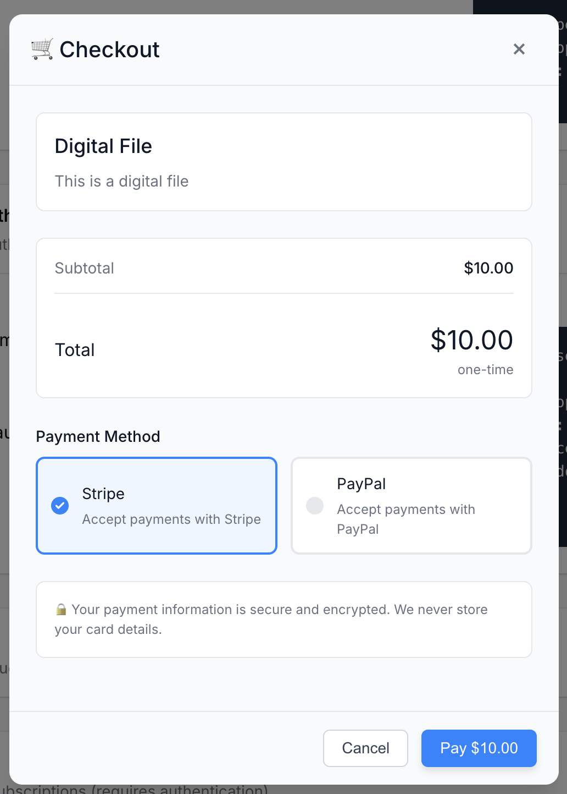
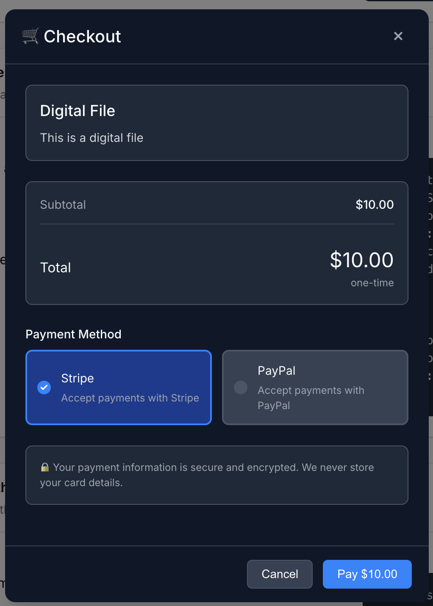
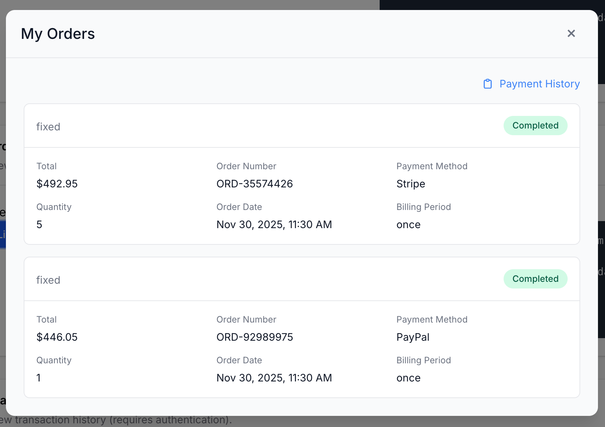
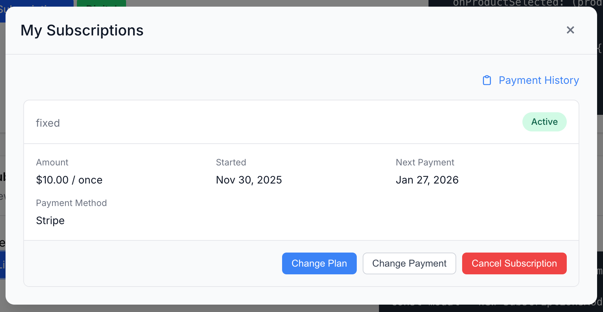
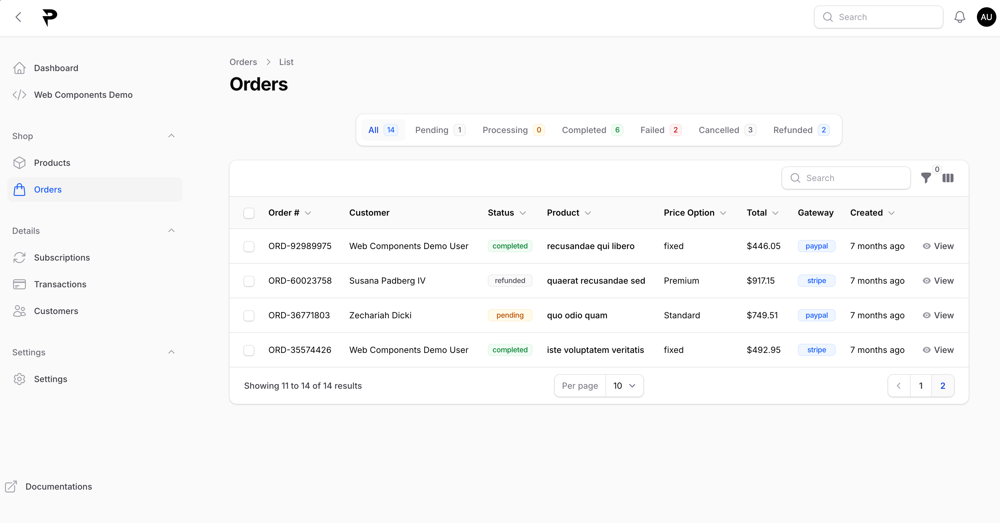

# PayCan

PayCan is a self-hosted payment-integration platform. External applications use its ready-to-use web components and API to accept different payment methods in ~10 lines of code.

> **[⭐️ Star PayCan on GitHub](https://github.com/paycan-app/paycan).**  
> Stars are signals of support. It takes one click and makes a big difference.


## Screenshots

<table>
<tr>
<td align="center">
<a href=".github/screenshots/checkout-light.png"></a>
<br><sub>Checkout modal (light)</sub>
</td>
<td align="center">
<a href=".github/screenshots/checkout-dark.png"></a>
<br><sub>Checkout modal (dark)</sub>
</td>
<td align="center">
<a href=".github/screenshots/orders-modal.png"></a>
<br><sub>Orders modal</sub>
</td>
<td align="center">
<a href=".github/screenshots/subscriptions-modal.png"></a>
<br><sub>Subscriptions modal</sub>
</td>
</tr>
<tr>
<td colspan="4" align="center">
<a href=".github/screenshots/admin-orders.png"></a>
<br><sub>Admin panel — Orders</sub>
</td>
</tr>
</table>

*Click any screenshot to view it at full size.*


## 👨‍💻 Philosophy

**Payment integration shouldn't be complicated.**

We believe every app should be able to collect money with just a few lines of code, without being locked into a single payment provider. PayCan's mission is to create a unified, vendor-agnostic payment integration that works seamlessly with any payment gateway while maintaining simplicity and flexibility.

No webhook handling, no customer creation, no subscription management.


- **Developer/Agent First**: Minimal setup, maximum functionality
- **No Vendor Lock-in**: Easily switch between payment providers
- **Unified API**: One interface for all payment gateways
- **Multiple Payment Gateways**: Currently supports PayPal and Stripe (Razorpay, Paddle, PayU, YooKassa, and Crypto on the roadmap)
- **Subscription and One-Time Plans**: Handle recurring payments effortlessly

- **Plan Management**: Dynamic subscription plan handling


Want more payment providers? **[⭐️ Star the repo](https://github.com/paycan-app/paycan)** and, if you can, [open an issue](https://github.com/paycan-app/paycan/issues) naming the provider or feature you need. Pull requests for roadmap items are always welcome 


### Development Notice

>This application is currently under active development and is not production-ready. Please use this for learning, development, and testing purposes only. Want to contribute? We'd love your help! 

## 🚀 Quick Start

#### 1. Install PayCan

Follow [INSTALLATION.md](INSTALLATION.md) (web installer at `/install`, demo with more code snippets at `/demo`), then use the admin panel to create products and get your API secret key. We have two types of tokens:


| Credential | Header | Used for |
|---|---|---|
| API secret key | `X-API-Key: <key>` | Admin API (server-to-server only — never expose it to browsers) |
| User token (JWT) | `Authorization: Bearer <token>` | User API and SDK, scoped to one user |

#### 2. Integrate Backend

Your backend exchanges the API secret key for a user-scoped token:

```bash
curl -X POST https://pay.yourapp.com/api/admin/users/sync \
  -H "X-API-Key: your_api_secret_key" \
  -H "Content-Type: application/json" \
  -d '{
    "user_id": "external-user-123",
    "user": { "name": "John Doe", "email": "john@example.com" }
  }'

# → { "token": "eyJ...", "user": { ... } }
```

#### 3. Integrate Frontend

The SDK lives in [sdk/front/](sdk/front/)

```html
<script type="module">
  import { PayCan, SubscriptionsModal} from 'https://paycan.yourapp.com/sdk/paycan-sdk.js';

  const paycan = new PayCan({ apiUrl: 'https://pay.yourapp.com' });

  // Token fetched from YOUR backend (which calls the users/sync endpoint above)
  const { token } = await (await fetch('/api/paycan/token')).json();
  paycan.setUserToken(token);

  // Open checkout modal for a product
  paycan.openCheckoutModal(productId, { theme: 'auto' });

  // Open subscription management modal for the user
  new SubscriptionsModal(paycan).open();

  // Or, if you prefer your own UI, get user orders directly from the API
  const orders = await paycan.orders.list();

</script>
```


## Web Components (UI Modals)

The SDK includes five framework-agnostic modal components. They render inside a Shadow DOM (no CSS conflicts with your page), are fully responsive, and support `light`, `dark`, and `auto` themes.

| Component | Purpose | Auth required |
|---|---|---|
| `CheckoutModal` | Full checkout flow: price selection, gateway selection, guest email | No (guest checkout is in beta) |
| `ProductsModal` | Browse products/plans; opens checkout on selection; can drive plan changes | No |
| `SubscriptionsModal` | List, cancel, and resume the user's subscriptions | Yes |
| `OrdersModal` | The user's order history with downloads and licenses | Yes |
| `TransactionsModal` | The user's payment history | Yes |

### Checkout and products modals (helper methods)

```javascript
// Checkout for a product (user picks a price)
paycan.openCheckoutModal(productId, {
  theme: 'dark',                 // 'light' (default) | 'dark' | 'auto'
  onSuccess: (checkoutUrl) => { window.location.href = checkoutUrl; },
  onCancel: () => {},
  onError: (error) => console.error(error),
});

// Checkout for a specific price
paycan.openCheckoutModalPrice(priceId, { theme: 'light' });

// Browse products; optionally filter by type
paycan.openProductsModal({
  type: 'subscription',          // 'physical' | 'digital' | 'service' | 'subscription'
  theme: 'auto',
  onProductSelected: (product) => console.log(product),
});
```

### Account modals (direct instantiation)

```javascript
import { PayCan, SubscriptionsModal, OrdersModal, TransactionsModal }
  from 'https://pay.yourapp.com/sdk/paycan-sdk.js';

const paycan = new PayCan({ apiUrl: 'https://pay.yourapp.com' });
paycan.setUserToken(token); // required for these modals

new SubscriptionsModal(paycan, { theme: 'auto', onClose: () => {} }).open();
new OrdersModal(paycan, { theme: 'light' }).open();
new TransactionsModal(paycan, { theme: 'dark', onError: (e) => console.error(e) }).open();
```


## Development

```bash
composer install && npm install
php artisan serve          # terminal 1
npm run dev                # terminal 2

npm run copy-sdk           # rebuild SDK and copy to public/sdk/
php artisan optimize:clear # clear caches after config/route changes
php artisan test           # run the Pest test suite
vendor/bin/pint --dirty    # code style
```

## Security

- Keep the API secret key on your server only; browsers must only ever receive user-scoped tokens.
- User tokens are limited to the authenticated user's own data.
- All public endpoints are rate-limited; webhooks are signature-verified.
- Store secrets in `.env`, never in code or the database.

Found a vulnerability? Please report it privately rather than opening a public issue.

> **[⭐️ Star PayCan on GitHub](https://github.com/paycan-app/paycan).**  
> Stars are signals of support. It takes one click and makes a big difference.